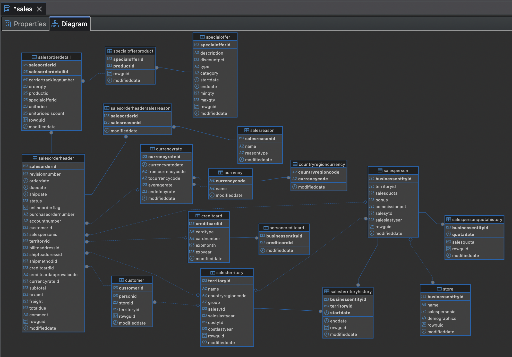
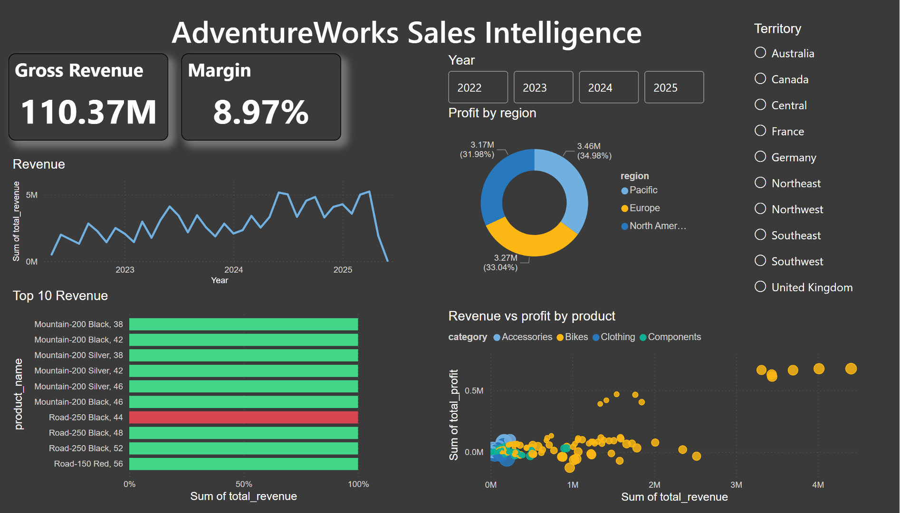
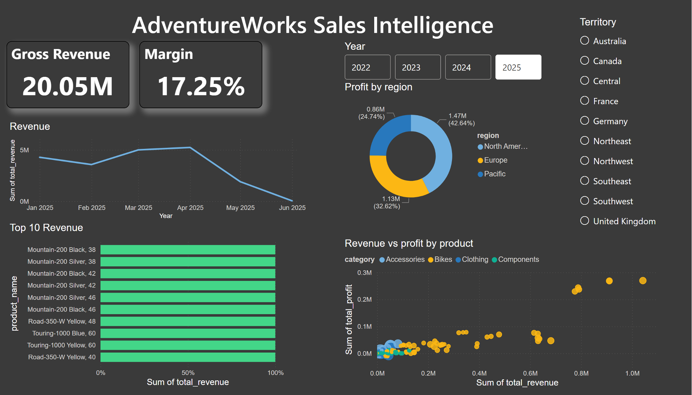
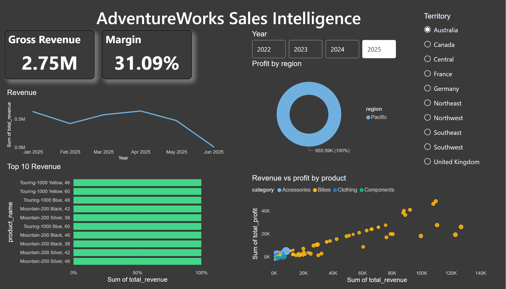

# Business Intelligence & Data Analytics Portfolio

## About
This repository contains a collection of Business Intelligence and data analysis projects focused on turning raw data into meaningful insights. The work covers the full workflow, from data preparation and modeling to analysis and visualization.

The goal is to demonstrate practical skills in solving business problems using data, not just building dashboards.

---

## What you will find here
Each project includes:
- Data cleaning and transformation
- Data modeling (with a focus on clear relationships and scalability)
- Analytical logic using DAX or SQL
- A dashboard designed for decision-making
- Key findings and business-oriented insights

---

## Tools and Technologies
- Power BI (data modeling, DAX, visualization)
- SQL (data extraction and transformation)
- Excel (data preparation and exploration)
- Power Query (ETL processes)

---

## Approach
The projects follow a consistent approach:
1. Data cleaning and preparation  
2. Data modeling with clear relationships  
3. Creation of measures and KPIs  
4. Dashboard design focused on usability  
5. Interpretation of results from a business perspective  

---

## Skills Demonstrated
- Data modeling and relational thinking  
- DAX and analytical calculations  
- ETL and data transformation  
- Data visualization best practices  
- Translating data into business insights  

---

## Notes
The datasets used are for practice purposes. The focus is on the analytical process, clarity of the model, and the ability to extract useful insights.

---
---

# Featured Project: AdventureWorks Sales Performance (PostgreSQL + Power BI)

> **Domain:** E-commerce & Retail Analytics  
> **Technical Focus:** SQL Schema Migration, Data Modeling & Financial KPI Analysis

---

## Repository Structure
    /AdventureWorks_E_commerce
    │
    ├── 📁 01_ETL_Scripts
    │   └── update_csvs.rb      
    │   └── install.sql      
    │
    ├── 📁 02_SQL_Analysis
    │   ├── geo_performance.sql    
    │   ├── Revenue_and_Profit_by_Category.sql 
    │   ├── top_10.sql   
    │   └── vw_sales_performance.sql   
    |
    ├── 📁 03_Visualization
    │   ├── AdventureWorks_Report.pbix 
    │   ├── dashboard_unfiltered.png
    │   ├── dashboard_last_year.png
    │   └── dashboard_australia_last_year.png
    │
    ├── 📁 04_docs
    │   └── ERD_Adventureworks.png 
    │
    └── README.md

---

## Data Architecture & Modeling
To ensure robust data integrity before visualization, the raw tables were modeled into a relational schema optimized for analytical querying.

### Data Source & Installation
The raw dataset used in this project is the **AdventureWorks OLTP** sample provided by Microsoft. 
* **Source:** [AdventureWorks Samples GitHub](https://github.com/Microsoft/sql-server-samples/tree/master/samples/databases/adventure-works)
* **Setup:** To replicate this repo, run the `install.sql` script located in the `/02_SQL_Analysis` folder after downloading the raw CSV files.

---

## Business Logic & SQL Performance

In this phase, I translated business requirements into optimized SQL queries. To ensure the database remains the "Single Source of Truth," I developed complex views instead of performing raw data manipulation in the visualization layer.

### 1. Key Business Metrics (KPIs)
I focused on three main pillars to evaluate the company's health:
* **Total Revenue:** Calculated as `UnitPrice * OrderQty` to ensure real-time accuracy.
* **Gross Profit:** Derived by subtracting `StandardCost` from total sales to measure actual earnings.
* **Profit Margin:** Used to identify the most efficient product categories.

### 2. High-Performance SQL Implementation
The following query aggregates **31,000+ sales records** to provide an executive summary by category:

    SELECT 
        pc.name AS Category,
        CAST(SUM(sod.unitprice * sod.orderqty) AS NUMERIC(18,2)) AS Total_Revenue,
        CAST(SUM((sod.unitprice * sod.orderqty) - (p.standardcost * sod.orderqty)) AS NUMERIC(18,2)) AS Total_Profit,
        COUNT(DISTINCT soh.salesorderid) AS Order_Count
    FROM sales.salesorderheader AS soh
    JOIN sales.salesorderdetail AS sod ON soh.salesorderid = sod.salesorderid
    JOIN production.product AS p ON sod.productid = p.productid
    JOIN production.productsubcategory AS ps ON p.productsubcategoryid = ps.productsubcategoryid
    JOIN production.productcategory AS pc ON ps.productcategoryid = pc.productcategoryid
    GROUP BY pc.name
    ORDER BY Total_Revenue DESC;

---

## Query Results & Business Intelligence

The following Key Performance Indicators (KPIs) were extracted using optimized SQL queries in PostgreSQL. These results form the basis for the final Power BI Dashboard.

### 1. Executive Summary: Revenue & Profit by Category

| Category | Total Revenue (USD) | Total Profit (USD) | Order Count |
| :--- | :--- | :--- | :--- |
| **Bikes** | $95,145,813.35 | $8,431,034.66 | 18,368 |
| **Components** | $11,807,808.02 | $495,447.92 | 2,650 |
| **Clothing** | $2,141,507.02 | $329,846.67 | 9,877 |
| **Accessories** | $1,278,760.91 | $643,082.29 | 19,524 |

> **Strategic Insight:** While **Bikes** drive the massive majority of revenue, **Accessories** dominate in transaction volume (19,524 orders). This indicates a high-frequency, low-ticket customer behavior that can be leveraged for cross-selling strategies.

### 2. Top 10 High-Revenue Products
The "Mountain-200" series is the undisputed leader in sales performance:

1. **Mountain-200 Black, 38:** $4,406,151.27
2. **Mountain-200 Black, 42:** $4,014,067.80
3. **Mountain-200 Silver, 38:** $3,696,486.47
4. **Mountain-200 Silver, 42:** $3,441,292.54
5. **Mountain-200 Silver, 46:** $3,436,090.79
6. **Mountain-200 Black, 46:** $3,311,098.44
7. **Road-250 Black, 44:** $2,518,299.76
8. **Road-250 Black, 48:** $2,348,246.09
9. **Road-250 Black, 52:** $2,012,447.78
10. **Road-150 Red, 56:** $1,847,818.63

### 3. Geographic Sales Performance (Top Territories)
The Southwest and Canada regions represent the strongest pillars for North American operations.

| Territory | Region | Sales Amount (USD) |
| :--- | :--- | :--- |
| **Southwest** | North America | $27,150,594.59 |
| **Canada** | North America | $18,398,929.19 |
| **Northwest** | North America | $18,061,660.37 |
| **Australia** | Pacific | $11,814,376.10 |
| **United Kingdom**| Europe | $8,574,048.71 |
| **France** | Europe | $8,119,749.35 |
| **Germany** | Europe | $5,479,819.58 |

---

## Interactive Dashboard (Power BI)

To provide stakeholders with dynamic insights, I developed an interactive Power BI dashboard. Below are three key views demonstrating the dashboard's filtering and cross-filtering capabilities.

### 1. Global Performance (Unfiltered)
Displays the all-time macro performance across all regions, categories, and years.

### 2. Recent Performance (Last Year)
Filters the data to analyze the most recent annual trends and overall profitability.

### 3. Regional Deep-Dive (Last Year + Australia)
Demonstrates cross-filtering by isolating the Pacific market's top-performing country during the latest financial year.

---

## Actionable Conclusions

1. **High-Frequency Funnel:** Accessories should be used as "loss leaders" or entry-point products in digital marketing, as they bring the most customers into the ecosystem.
2. **Inventory Focus:** The Mountain-200 Black series (sizes 38 & 42) should have 100% stock availability, as they alone generate over $8.4M in revenue.
3. **Market Optimization:** Australia is the strongest market outside of North America, outperforming any individual European country. This suggests a need for localized logistics or distribution hubs in the Pacific region.